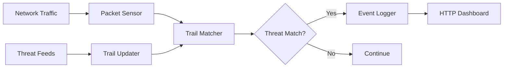

# SecureFlow Detect — AI-Powered Malware Traffic Detection System

A network-based threat detection system that passively monitors traffic and identifies malicious activity using 50+ real-time threat intelligence feeds and an extensive IOC database.

## Architecture



## Features

- **Real-time packet capture** — passive monitoring via pcapy-ng with no network disruption
- **50+ threat intelligence feeds** — aggregates from AbuseIPDB, AlienVault OTX, Emerging Threats, URLhaus, and more
- **IOC matching** — 2900+ trail lists covering malware families, C2 servers, mass scanners, and suspicious domains
- **Web dashboard** — real-time browser-based event viewer with filtering and search
- **Configurable alerting** — flexible event logging with customizable severity levels
- **Plugin system** — extensible analysis plugins (peek, strings) for deep packet inspection

## Quick Start

```bash
# Install dependency
pip install pcapy-ng

# Update threat trails
python core/update.py

# Start sensor (requires root/admin)
sudo python sensor.py

# Start reporting server (separate terminal)
python server.py

# Open dashboard
open http://localhost:8338
```

## Configuration

Edit `secureflow-detect.conf` to configure:
- Network interface to monitor
- HTTP server port (default: 8338)
- Log directory and rotation
- Whitelisted IPs and domains
- Trail update schedule

## Project Structure

```
secureflow-detect/
├── sensor.py              # Main packet capture engine
├── server.py              # HTTP reporting server
├── secureflow-detect.conf # Configuration file
├── core/
│   ├── settings.py        # Global settings and config parser
│   ├── common.py          # Shared utilities
│   ├── addr.py            # IP address utilities
│   ├── trailsdict.py      # Thread-safe trail dictionary
│   ├── update.py          # Threat feed updater
│   ├── httpd.py           # HTTP server implementation
│   └── log.py             # Event logging
├── trails/
│   ├── feeds/             # 50+ threat intelligence feed parsers
│   └── static/            # Static IOC database
├── plugins/               # Traffic analysis plugins
├── html/                  # Web dashboard
└── tests/                 # Unit tests
```

## What I Learned

Building SecureFlow Detect gave me deep insight into **network security monitoring** and **threat intelligence**:

- How passive network sensors capture and decode packets at the OS level
- The architecture of IOC (Indicator of Compromise) matching systems — how to efficiently look up millions of IPs/domains in real time
- Aggregating and normalizing data from 50+ heterogeneous threat feeds, each with different formats
- Building a real-time event dashboard that renders incoming threat events without page refresh
- The challenges of high-throughput packet processing: parallel workers, lock-free data structures, memory efficiency

## Requirements

- Python 3.8+
- `pcapy-ng` (packet capture library)
- Root/administrator privileges for packet capture

## Credit

Based on [Maltrail](https://github.com/stamparm/maltrail) by [stamparm](https://github.com/stamparm), licensed under MIT.

## License

MIT License — see [LICENSE](LICENSE) for details.
